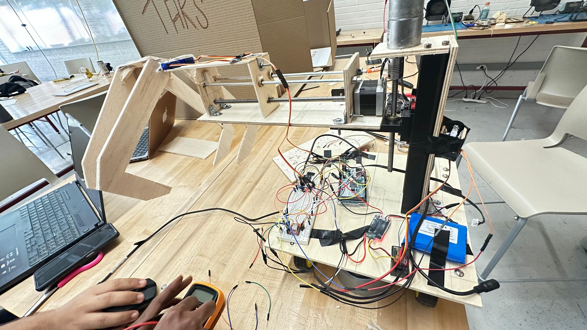
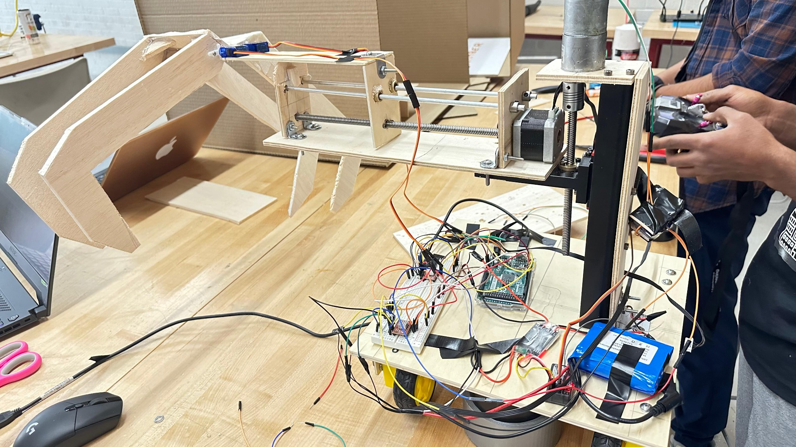
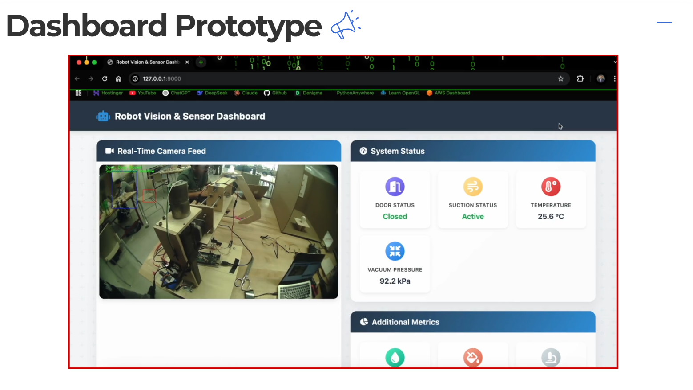
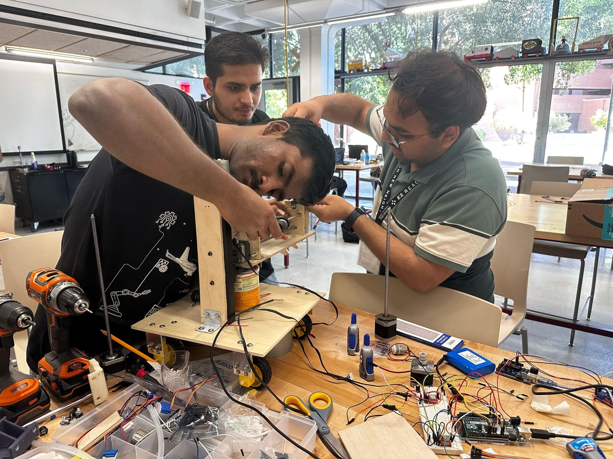

# Automating LPBF Post-Processing

**Team TARS · ASU Devils Invent: Aerospace Factory to the Future · Sponsored by Honeywell**

A rapid physical prototype developed for a robotics-and-automation hackathon challenge in aerospace manufacturing. The project explored a safer, more repeatable way to handle the post-build steps around a laser powder bed fusion (LPBF) cell: opening the build chamber, removing loose powder, and extracting a printed part.

*Vamsikrishna with the completed Team TARS prototype at the event.*

[Watch or download the 34-second bench demonstration](media/videos/lpbf-post-processing-demo-preview.mp4) *(compressed preview; audio removed)*

## The problem

The supplied challenge brief identified automated material handling as a way to improve precision and efficiency in a factory environment, while reducing contamination risk and cycle time. Team TARS focused on the manual post-processing workflow after laser-metal printing, where personnel would otherwise interact directly with the build chamber, loose powder, and finished part.

## What we built

The physical demonstration was a compact, wheeled proof of concept built from rapidly fabricated structural parts, lead-screw motion hardware, hobby servos, a stepper-driven axis, on-board electronics, and a battery pack.

The evidence captured during the event shows:

- A wheeled base carrying the electronics and power system.
- Horizontal and vertical lead-screw mechanisms for the material-handling assembly.
- A servo-linked end mechanism and a mocked interaction zone labelled **Sintering Chamber**.
- Actuation of the handling mechanism in the supplied bench demonstration.

## Proposed LPBF post-processing flow

The team presentation proposed this sequence:

1. Motorize opening of the build chamber.
2. Remove excess powder through a sealed vacuuming concept.
3. Extract the printed part using a gripper.
4. Monitor the workflow through computer vision and a dashboard concept.

The physical prototype was an early demonstration of the handling mechanism. The powder-removal system, computer vision, production safety systems, and industrial LPBF equipment were **concept elements**, not validated production capabilities of this prototype. A dashboard UI prototype is documented below, but its end-to-end live integration was not verified in the supplied archive.

## Dashboard prototype

The team also created a local **Robot Vision & Sensor Dashboard**. The supplied screenshot shows a camera view alongside status cards for the door, suction, temperature, and vacuum pressure. At the instant captured, the interface displayed `Door Status: Closed`, `Suction Status: Active`, `Temperature: 25.6 °C`, and `Vacuum Pressure: 92.2 kPa`.

This screenshot establishes that a dashboard UI prototype was built. It does not by itself verify the data source, sensor calibration, telemetry timing, or live end-to-end hardware integration.

## Engineering scope

This was a fast-build hackathon project, so the work emphasized system layout, mechanism integration, and a demonstrable physical prototype rather than a production-ready machine. The available archive does not include source code, detailed wiring diagrams, CAD, motion tuning data, or measured cycle-time results.

See [evidence and limitations](docs/evidence-and-limitations.md) for the boundary between demonstrated hardware and proposed functionality.

## Team TARS

- **Vamsikrishna Kurakalva** — Mechanical Engineering
- **Chandra Prakash Pandey** — Computer Science, minor in Data Science
- **Kushagra Chaudhary** — Computer Science and Business
- **Soham Karandikar** — Mechanical Engineering

## Event evidence

- [Event cover slide](media/images/06-event-cover.png) — ASU Devils Invent, *Aerospace Factory to the Future*, sponsored by Honeywell.
- [Challenge brief](media/images/07-challenge-brief.png) — Problem Statement 3: Robotics & automation.
- [Media index](docs/media.md) — source-to-file mapping for the photos and demonstration video.
- [Source notes](docs/source-notes.md) — references listed in the team presentation.

## Important prototype boundary

This repository documents a student hackathon proof of concept. It is **not** a laser powder bed fusion machine, a powder-handling system, or an operating guide for metal additive manufacturing. No laser, metal powder, inert-gas enclosure, industrial safety hardware, or real printed component is shown or claimed here.
